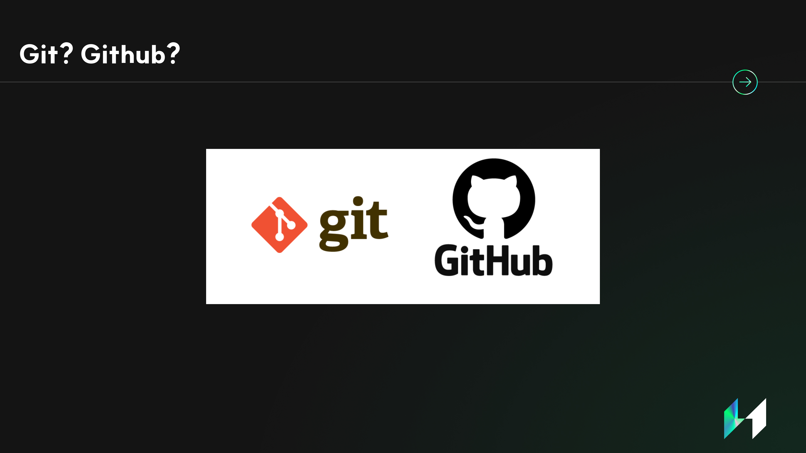

# SSUMC 6th GitHub Guide Session

## 개요

**SSUMC 6기**에서 처음 진행한 행사로, 기존에 노션으로 관리하던 스터디 방식을 **GitHub**으로 마이그레이션하여 진행하기로 하였습니다. 이에, 신입 챌린저(부원) 리크루팅 이후 GitHub에 미숙한 챌린저들을 위해 **Guide Session**을 직접 기획, 진행하였습니다.

\- **SSUMC 6기 리더 태태/권정태** - 

## 세션 내용

1. **기획 의도**
2. **Git? Github?**
3. **Git Terms/Commands**
4. **Hands-On Practice**
    - 본인의 브랜치를 생성한다.
    - 본인의 `local repository`에서,[calculator.c](https://github.com/SSUMC-6th/TEST/blob/main/calculator.c) 소스코드에, 기능을 추가한다.
    - `origin repository`에 있는 본인 브랜치에 `push`한다.
    - `origin repository`에 있는 본인 브랜치에서, `origin repository main(master) branch`로 `pull request`를 요청한다.

## 발표자료

                               
